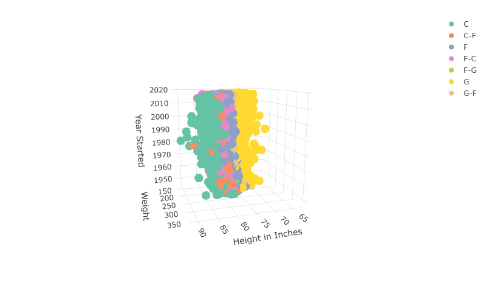

```{r setup, include=FALSE}
knitr::opts_chunk$set(echo = FALSE, warning = FALSE, message = FALSE, results = "hide")
```

```{r, echo = FALSE}
# setting up environment and reading in data
library(plotly)
library(tidyverse)
library(ggthemes)
bb = read.csv("PlayersBBall.csv", header =TRUE)
# head(bb)
```

```{r, echo = FALSE}
# separated "height" into feet and inches columns, then calculated height in inches
bb = bb %>% separate(height, c("feet", "inches"), "-", convert = TRUE, remove = FALSE)
bb = bb %>%
  mutate(height_in_inches = (feet * 12) + inches)
# head(bb)
```

# NBA Player Data

## 1.1: Players at Each Position

```{r}
bb %>% ggplot(mapping = aes(x = position)) +
  geom_bar() +
  xlab("Position") +
  ylab("Number of Players") +
  ggtitle("Players at Each Position") +
  theme_economist()
```

## 1.2: Distribution of Weights for Centers and Forwards

This boxplot shows that centers tend to be heavier than forwards.

```{r}
bb %>% filter(position == "C" | position == "F") %>%ggplot(mapping = aes(x = position, y = weight)) +
  geom_boxplot() +
  xlab("Position") +
  ylab("Weight") +
  ggtitle("Weights of Centers and Forwards") +
  theme_economist()
```

## 1.3: Distribution of Heights for Centers and Forwards

Based on this boxplot, we see that centers also tend to be taller than forwards.

```{r}
bb %>% filter(position == "C" | position == "F") %>% ggplot(mapping = aes(x=position, y=height_in_inches)) +
  geom_boxplot() +
  ylab("Height in Inches") +
  xlab("Position") +
  ylab("Height") +
  ggtitle("Heights of Centers and Forwards") +
  theme_economist()
```

## 1.4: Distribution of Heights for All Positions

Based on this boxplot, we see that centers, forward-centers, and
center-forwards tend to be the tallest players. Forwards, forward-guards, and
guard-forwards tend to be a bit shorter, while pure guards tend to be the
shortest.

```{r}
bb %>% ggplot(mapping = aes(x=position, y=height_in_inches)) +
  geom_boxplot() +
  ylab("Height in Inches") +
  xlab("Position") +
  ylab("Height") +
  ggtitle("Distribution of Heights for All Positions") +
  theme_economist()
```

## 1.5: Relationship Between Height and Weight

This scatterplot shows a generally linear, positive correlation between height and weight.

```{r}
bb %>% ggplot(mapping = aes(x=weight, y=height_in_inches))+
  geom_point(position = "jitter") +
  geom_smooth() +
  xlab("Weight") +
  ylab("Height in Inches") +
  ggtitle("Relationship Between Height and Weight") +
  theme_economist()
```

## 1.6: Relationship Between Height and Weight by Position

The positive correlation between height and weight appears to hold true across
all positions, to varying extents: there is a slight tendency for pure at the
high end of the weight distribution to be around the same height, and
forward-centers at the high end of the weight distribution tend be a little
shorter than those in the middle of the weight distribution.

```{r}
bb %>% ggplot(mapping = aes(x=weight, y=height_in_inches)) +
  geom_point(position = "jitter") +
  geom_smooth() +
  xlab("Weight") +
  ylab("Height in Inches") +
  ggtitle("Height and Weight by Position") +
  facet_wrap(~position) +
  theme_economist()
```

## 1.7: Distribution of Height by Year Started

This Loess Curve confirms that there is a clear trend in the increase of NBA player heights based on the year they started.

```{r}
bb %>% ggplot(mapping = aes(x=year_start, y=height_in_inches)) +
  geom_smooth() +
  xlab("Year Started") +
  ylab("Height in Inches") +
  ggtitle("Distribution of Height by Year Started") +
  theme_economist()
```

## 1.8: 3D Plot of Height, Weight, and Year Started



```{r}
bb %>% plot_ly(x = ~height_in_inches, y = ~weight, z = ~year_start, color = ~position) %>%
  add_markers() %>%
  layout(scene = list(xaxis = list(title = "Height in Inches"),
                      yaxis = list(title = "Weight"),
                      zaxis = list(title = "Year Started")))
```

## 1.9: Violin Plot of Distribution of Height by Position

This violin plot shows the density of the distribution of player heights by position. It provides a similar, yet visually-distinct, view of the distribution from 1.4 above.

```{r}
bb %>% ggplot(mapping = aes(x=position, y=height_in_inches)) +
  geom_violin() +
  xlab("Position") +
  ylab("Height in Inches") +
  ggtitle("Distribution of Height by Position") +
  theme_economist()
```

# Relationship Between Education and Income

```{r, echo = FALSE}
ei = read.csv("Education_Income.csv", header =TRUE)
# head(ei)
```
```{r, echo = FALSE}
ei = ei %>% separate(Educ, c("low_end", "high_end"), "-", convert = TRUE, remove = FALSE)
ei = ei %>% mutate(highest_education = ifelse(is.na(high_end), low_end, high_end))
# head(ei)

options(scipen=999)
```

## 2.1: Distribution of Income as Education Level Rises

There appears to be a clear relationship between income and education level,
with those participants who completed less than 12 years of education having the
least earning power, and those with 16 or more years of education having the
highest incomes.

```{r}
ei %>% ggplot(mapping = aes(x = highest_education, y = Income2005)) +
  geom_boxplot() +
  xlab("Highest Year of Education Achieved") +
  ylab("Income in 2005") +
  ggtitle("Income as Education Level Rises") +
  theme_economist()
```

# Key Takeaways and Questions

### Takeaways

1. The Grammar of Graphics is the structure of how to code GGPlot graphics. It combines data mapping statements with geometric functions to easily create graphs from raw data. These graphs can be split up with facet functions (to separate visualizations by factors) can be styled with labels, colors, titles, and themes to improve their presentation.

2. Plotly provides an easy way to enhance the functionality of GGPlot visualizations, and to create 3D plots.

### Questions

1. Since a Loess curve isn't a sum of least squares, how is it derived? When is it best used?

2. I ran into some issues with the size/proportions of my GGPlots when I knitted into Powerpoint, especially with titles: what looked good in RStudio would be lower-resolution, and would cut off longer titles, in PowerPoint. Aside from continuing to delve into the dark arts of the Pandoc-PowerPoint integration (which I have done a little bit of), is there any way to control the scale of GGPlot visualizations from the actual code?