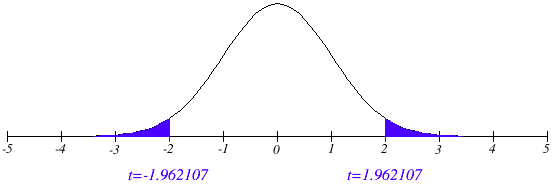

```{r setup, include=FALSE}
knitr::opts_chunk$set(echo = FALSE, warning = FALSE, message = FALSE, results = "hide")
```

# Part 1: Left Midfielders vs. Left Forwards

## 1.1: Creating Filtered Dataset

```{r, echo = TRUE}
library(dplyr)
library(GGally)
library(ggplot2)
library(tidyr)

fifa = read.csv("FIFA Players.csv", header = TRUE)
head(fifa)
lm_lf = fifa %>% 
  filter(Position == "LM" | Position == "LF")
head(lm_lf)
```

---

## 1.2 and 1.3: Acceleration and Agility for LM and LF

The distribution of Acceleration and Agility for Left Midfielders appears to be left skewed, with some extreme outliers, but for both positions the mean and variance appear similar. 

```{r, echo = TRUE}
lm_lf %>% select(Position, Acceleration, Agility) %>% 
  ggpairs(aes(color = Position))
```

---

## 1.4: T-Test for Mean Agility Rating

### Step 1: Problem Statement and Hypotheses

Given the FIFA player dataset, we want to test the claim that the mean Agility rating of Left Midfielders is different than that of Left Forwards. Our null hypothesis is that there is no difference in means between the two positions, and our alternative hypothesis is that the means of the two groups are not the same.

#### H~0~: $$\mu_{\text{LM}} - \mu_{\text{LF}} = 0$$

#### H~a~: $$\mu_{\text{LM}} - \mu_{\text{LF}} \neq 0$$

---

### Step 2: Critical Value

```{r}
lm_lf %>% count(Position)
```

We see that there are 15 LFs in our dataset (which is a very small number!) and 1095 LMs, so the degrees of freedom for the pooled dataset is 1108. R calculates a Critival Value of 1.962107.

```{r}
crit_val = qt(.975, 1108)
crit_val
```



---

### Step 3 and 4: Test Statistic and P-Value

```{r}
t.test(Agility ~ Position, data = lm_lf, var.equal = TRUE)
```

The t.test() function shows that our test statistic is 1.8109, and our p-value is .07043. 

---

### Step 5 and 6: Reject or Fail to Reject H~0~ / Statistical Conclusion

Because the p-value is greater than .05 we fail to reject the null hypothesis: there is not sufficient evidence to suggest there is a difference in mean between the two groups. If this sample were random then we could make inferences to the population about it, but that's not clear from the dataset. I also note that I am not totally clear about how to run a t-test like this, with our other t-tests we only had one continuous variable (height, cash, etc.) so I looked at the documentation and I have a feeling I did something wrong because the R output is conflicted with my interpretation of the p-value (it states that H~A~ is true). I may be overthinking this.

## 1.5: Assumptions of T-Test

A histogram of Agility scores for LF and LM positions shows that the assumptions of the t-test are not met! The samples are not of similar size, spread, or skewness. In fact, there is barely any shape to the LF histogram at all because there are only 15 units in the sample. 

```{r}
lm_lf %>% ggplot(aes(x = Agility)) +
  geom_histogram() +
  facet_wrap(~Position)
```

# Part 2: EDA

I've never played FIFA, and I don't know much about soccer, but I played way too much Madden in college. In Madden there is an attribute called "Awareness" which seems to affect how an in-game character might react to other game events when they aren't being controlled by the player. This was always interesting to me because it's an attempt to map something very psychological to what is (fundamentally) a 3D physics simulation. For that reason, I was drawn to the FIFA attribute of "Composure." I'm curious as to whether this attribute has any relationship to age, or to overall rating, and whether there are any positional considerations related to composure.

I explored this dataset with an eye towards the categorical variables of Age and Position, and how they relate to Overall and Composure ratings. To enable some categorical views based on age, I used the "cut()" function to create an "age band" column.

```{r}
comp_dataset <- fifa %>% 
  select(Preferred.Foot, Age, Overall, Composure) %>%
  mutate(age_band = factor(
      cut(Age, 
          breaks = c(10, 19, 29, 39, 49), 
          labels = c("Teens", "20s", "30s", "40s"),
          right = TRUE),
      levels = c("Teens", "20s", "30s", "40s"),
      ordered = TRUE
    ),
  Preferred.Foot = factor(Preferred.Foot, levels = c("Left", "Right"))
  )
summary(comp_dataset)
```

---

A summary of mean composure by age band shows that mean composure increases from teens to 20s, and from 20s to 30s, but that it declines in players in their 40s. However, there are only 22 players in the 40s age band, so those results should be viewed with skepticism. I, personally, find myself to be exponentially more composed in my 40s, but that's purely anecdotal.

```{r}
comp_dataset %>% group_by(age_band) %>% summarize(mean_composure = mean(Composure, na.rm = TRUE), count = n())

comp_dataset %>% ggplot(aes(x = Composure, color = age_band)) +
  geom_boxplot()
```

---

A similar breakdown of composure by preferred foot shows that the center, shape, and spread of composure appears to be the same for both lefties and righties.

```{r}
comp_dataset %>% group_by(Preferred.Foot) %>% summarize(mean_composure = mean(Composure, na.rm = TRUE), count = n())

comp_dataset %>% ggplot(aes(x = Composure, color = Preferred.Foot)) +
  geom_boxplot()
```

---

Of course, the most interesting potential feature of composure would be its relationship to overall rating. The below Loess Curve shows that, for players with less than approximately 40 composure, there is an negative linear relationship between composure and overall rating! However, for players with a composure rating higher than 40, there is a positive linear relationship between composure and overall rating.

```{r}
comp_dataset %>% ggplot(aes(x = Composure, y = Overall)) +
  geom_smooth() +
  scale_x_continuous(breaks = seq(0, max(comp_dataset$Composure, na.rm = TRUE), by = 10))
```

# Part 3: Key Takeaways and Questions

## Key takeaways

1. Filter(), arrange(), select(), mutate(), and summarize() are key DPLYR functions for transforming datasets and facilitating EDA in R.
2. EDA is very much both an art and a science, combining general analysis and natural curiosity with visualization, summarization, and statistical tools.
3. Vectors in R are similar to arrays and dynamic arrays in other programming languages, with their own nuances, and there are some good functions for working with them (like STR(), subsetting, and is.na()).

## Questions

1. I noted above that I think I might have gotten turned around on my t-test results for the mean difference between Left Midfielders and Left Forwards.
2. I want to learn more about mutating and cutting columns with mixed data types (for example, the Wage column in the FIFA data). I know there is a way to do it, I started down the rabbit hole but ultimately abandoned it for the sake of time. Which leads me to...
3. The basics of DPLYR and the general practice of EDA are very clear to me from the reading and lectures, but this is something that has to be practiced. I'm working on my time management, trying to do my reading/lectures on weeknights so that I can spend more time focused on FLS and homework assignments during the weekend, because I want to spend as much time on those assignments as I can. I know this isn't the best I'm capable of doing, I want to really dig in more on R and produce very polished work. 